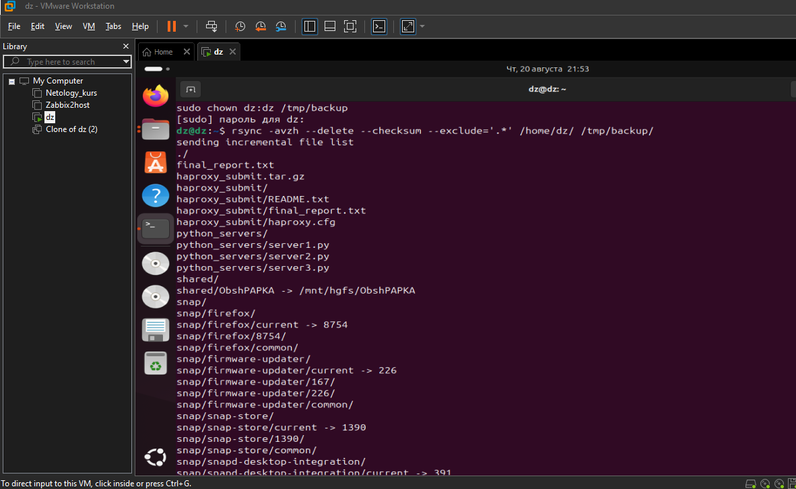
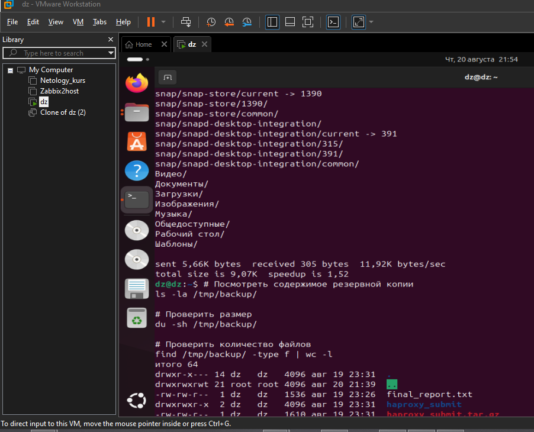
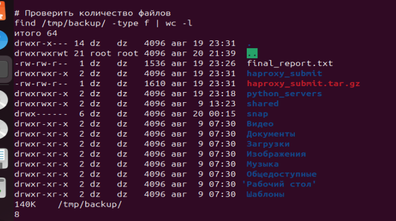
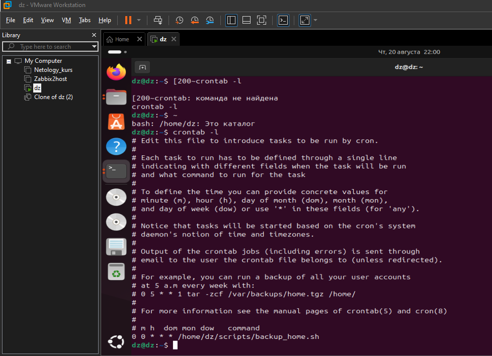
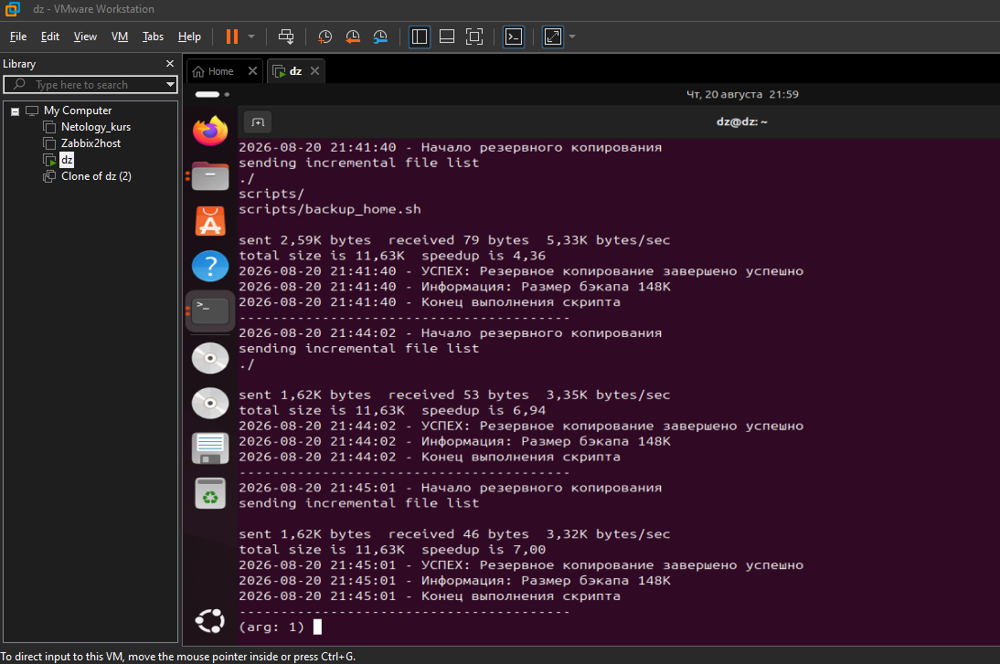

# Домашнее задание к занятию "Резервное копирование" - Кошелев Дмитрий

### Задание 1

1. `Создаем директорию для резервной копии 
sudo mkdir -p /tmp/backup`
2. ` Проверяем права доступа (директория должна принадлежать пользователю dz)
sudo chown dz:dz /tmp/backup`
3. `Команда rsync
rsync -avzh --delete --checksum --exclude='.*' /home/dz/ /tmp/backup/`

`Разбор команды:
-a — архивный режим (сохраняет права, ссылки, временные метки)
-v — подробный вывод (verbose)
-z — сжатие при передаче
-h — человекочитаемый формат
--delete — удаляет файлы в приемнике, которых нет в источнике (делает зеркальной)
--checksum — сравнивает хэш-суммы, а не только размер и время
--exclude='.*' — исключает все скрытые директории и файлы`
`

Скриншоты:
;
;
;

---

### Задание 2

1. `Создаем скрипт резервного копирования

https://github.com/rooot-root/39_backup_reserv/blob/main/backup_home.sh

`делаем его исполняемым
chmod +x /home/dz/scripts/backup_home.sh`

2. `Открываем crontab для пользователя dz
crontab -e`

3. `Резервное копирование домашней директории каждый день в 00:00
0 0 * * * /home/dz/scripts/backup_home.sh
Или для тестирования каждую минуту (удалите после теста)
* * * * * /home/dz/scripts/backup_home.sh``

`Проверяем, что задача добавлена
crontab -l
Проверяем, запущен ли cron
sudo systemctl status cron
Если cron не запущен, запускаем
sudo systemctl start cron
sudo systemctl enable cron`

4.`Просмотр системного лога с фильтром
sudo tail -f /var/log/syslog | grep backup_home
Или посмотреть последние записи
sudo grep backup_home /var/log/syslog | tail -10 `

Скриншоты:
;
;

